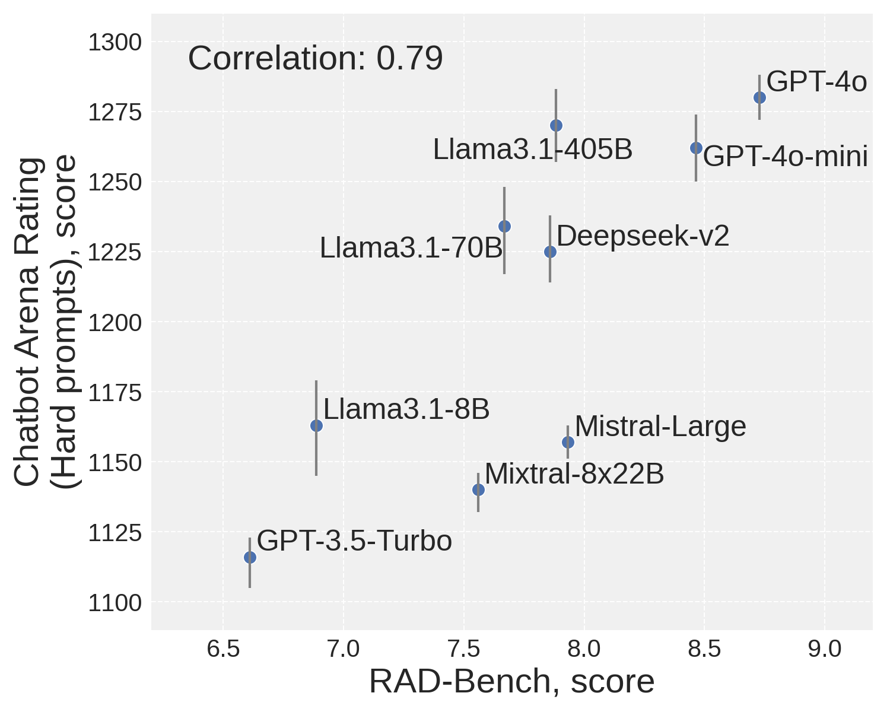
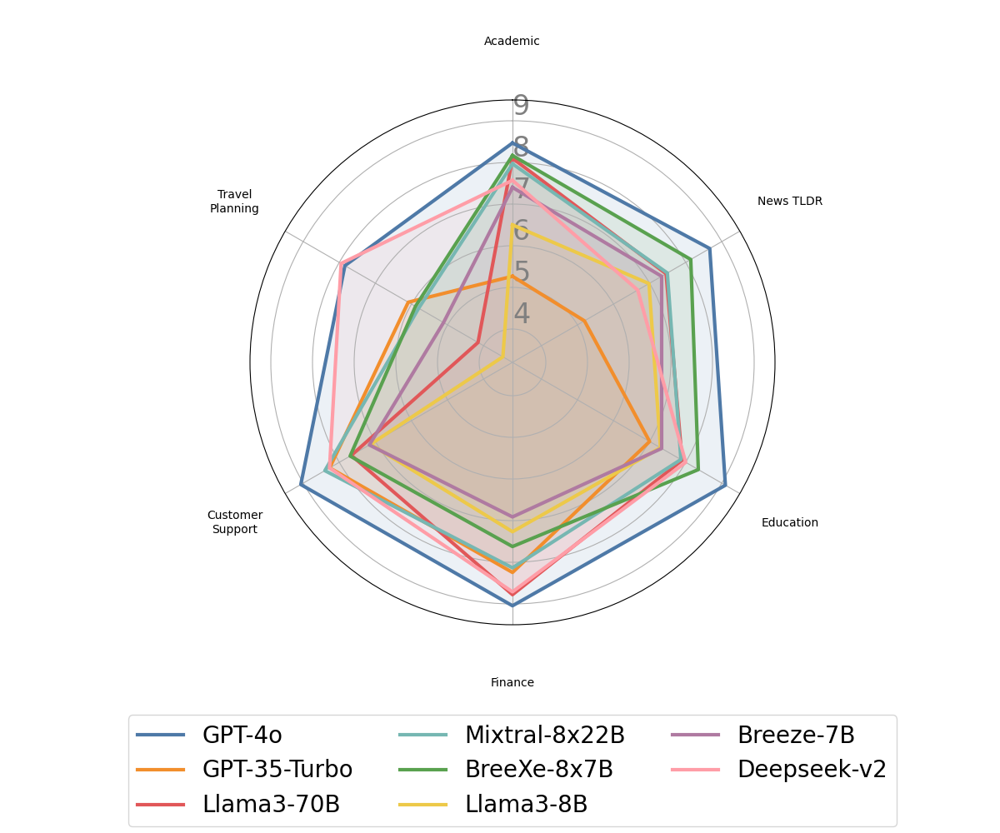

# RAD-Bench

**RAD-Bench: Evaluating Large Language Models Capabilities in Retrieval
Augmented Dialogues**

Tzu-Lin Kuo*, Feng-Ting Liao*, Mu-Wei Hsieh,
Fu-Chieh Chang, Po-Chun Hsu, Da-Shan Shiu

*core contributors

This is the official repo of the RAD-Bench.

## Benchmark results


|                            |   academic |   news |   education |   finance |   customer |   travel |   average |
|:---------------------------|-----------:|-------:|------------:|----------:|-----------:|---------:|----------:|
| gpt-4o                |       8.77 |   8.68 |        8.95 |      9    |       9.1  |     7.83 |      8.72 |
| gpt-35-turbo-16k-4k   |       5.3  |   5.23 |        6.55 |      8.07 |       8.47 |     5.93 |      6.59 |
| llama3-70b-instruct        |       7.67 |   7.37 |        7.95 |      8.62 |       7.77 |     4.26 |      7.27 |
| mixtral-8x22b-instruct     |       7.7  |   7.47 |        7.97 |      8.22 |       8.1  |     5.79 |      7.54 |
| deepseek-chat              |       7.57 |   6.67 |        8    |      8.71 |       8.27 |     7.95 |      7.86 |
| breexe-8x7b-instruct-v01   |       8.47 |   8.14 |        8.58 |      7.56 |       7.63 |     5.74 |      7.69 |
| llama3-8b-instruct         |       6.97 |   6.96 |        7.47 |      7.31 |       7.13 |     3.48 |      6.55 |
| breeze-7B-32k-instruct-v10 |       7.47 |   7.33 |        7.8  |      6.93 |       7.13 |     4.83 |      6.92 |

## Installation
```
pip install -r requirements.txt
```

## Inference
Simply do,
```
cd magic/script
sh run_inference.sh
```

## Evaluation
Simply do,
```
cd magic/script
sh run_evaluation.sh
```

## Visulization
To see the results, do
```
cd magic/script
sh run_qa_browser.sh
```
then open `localhost:1234` in your browser


## Citation
Please cite this repo with
```
@misc{rad-kuo2024,
      title={RAD-Bench: Evaluating Large Language Models Capabilities in Retrieval
Augmented Dialogues},
      author={Tzu-Lin Kuo, Feng-Ting Liao, Mu-Wei Hsieh, Fu-Chieh Chang, Po-Chun Hsu, Da-Shan Shiu},
      year={2024}
}
```
