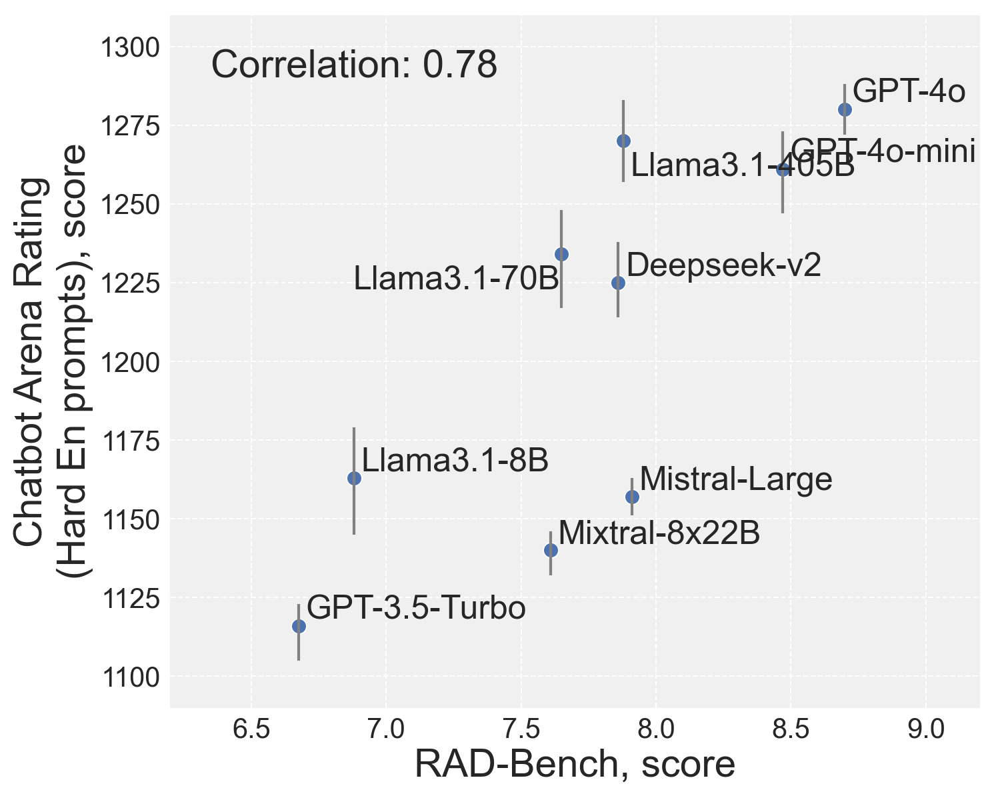

# RAD-Bench

**RAD-Bench: Evaluating Large Language Models Capabilities in Retrieval
Augmented Dialogues**

Tzu-Lin Kuo*, Feng-Ting Liao*, Mu-Wei Hsieh,
Fu-Chieh Chang, Po-Chun Hsu, Da-Shan Shiu

*core contributors

This is the official repo of the RAD-Bench.

## Benchmark results


<div style="text-align: center;">
  
  
</div>

| **Name**       | **Academic** | **News** | **Education** | **Finance** | **Customer** | **Travel** | **Average** |
|----------------|--------------|----------|---------------|-------------|--------------|------------|-------------|
| GPT-4o         | _8.77_       | _8.68_   | _8.95_        | _9.00_      | _9.10_       | 7.83       | _8.72_      |
| GPT-4o-mini    | 8.27         | 8.53     | 8.80          | 8.87        | 8.53         | 7.80       | 8.47        |
| Mistral-Large  | 8.17         | 7.77     | 8.33          | 8.58        | 7.83         | 6.76       | 7.91        |
| GPT-3.5-Turbo  | 5.30         | 5.23     | 6.55          | 8.04        | 8.47         | 5.93       | 6.59        |
| Llama3.1-405B  | 7.90         | **8.07** | 8.25          | 8.22        | 7.63         | 7.21       | **7.88**    |
| Llama3.1-70B   | 8.03         | 7.72     | 8.25          | 8.02        | 6.83         | 7.07       | 7.65        |
| Mixtral-8x22b  | 7.70         | 7.47     | 7.97          | 8.22        | 8.10         | 5.79       | 7.54        |
| Gemma-2-27B    | 5.50         | 3.60     | 3.05          | 7.71        | 6.17         | 1.52       | 4.59        |
| Deepseek-v2    | 7.57         | 6.67     | 8.00          | **8.71**    | **8.27**     | _**7.95**_ | 7.86        |
| BreeXe-8x7B    | **8.47**     | 8.14     | **8.58**      | 7.56        | 7.63         | 5.74       | 7.69        |
| Mistral-Nemo-12B | 7.20       | 6.84     | 7.42          | 7.33        | 7.47         | 3.55       | 6.63        |
| Gemma-2-9B     | 5.63         | 3.61     | 3.17          | 8.04        | 6.00         | 1.50       | 4.66        |
| Llama3.1-8B    | 7.33         | 6.16     | 7.53          | 8.33        | 6.77         | 5.17       | 6.88        |
| Breeze-7B      | 7.47         | 7.33     | 7.80          | 6.93        | 7.13         | 4.83       | 6.92        |

## Installation
```
pip install -r requirements.txt
```

## Inference
Simply do,
```
cd rad_bench/script
sh run_inference.sh
```

## Evaluation
Simply do,
```
cd rad_bench/script
sh run_evaluation.sh
```

## Visulization
To see the results, do
```
cd rad_bench/script
sh run_qa_browser.sh
```
then open `localhost:1234` in your browser


## Citation
Please cite this repo with
```
@misc{rad-kuo2024,
      title={RAD-Bench: Evaluating Large Language Models Capabilities in Retrieval
Augmented Dialogues},
      author={Tzu-Lin Kuo, Feng-Ting Liao, Mu-Wei Hsieh, Fu-Chieh Chang, Po-Chun Hsu, Da-Shan Shiu},
      year={2024}
}
```
