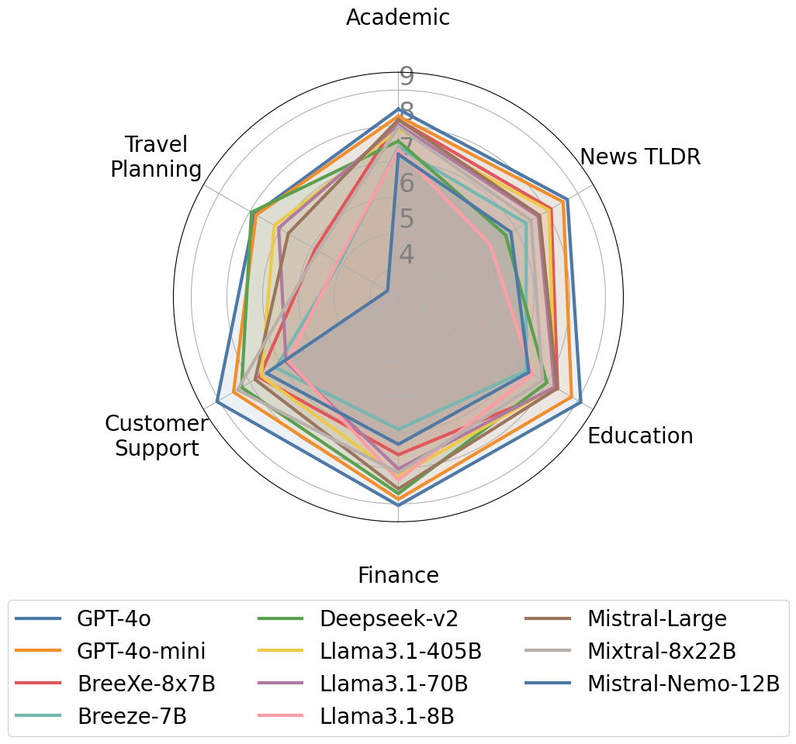

# MAGIC-Bench

**MAGIC-Bench: A Benchmark for Evaluating Large Language Models with
Context Utilization in Multi-Turn Dialogues**

Tzu-Lin Kuo*, Mu-Wei Hsieh,
Fu-Chieh Chang, Po-Chun Hsu, Da-Shan Shiu, Feng-Ting Liao*

*core contributors

.... paper coming soon.

## Benchmark results


|               |   academic |   news |   education |   finance |   customer |   travel |   average |
|:--------------|-----------:|-------:|------------:|----------:|-----------:|---------:|----------:|
| GPT-4o        |       8.77 |   8.68 |        8.95 |      9    |       9.1  |     7.87 |      8.73 |
| GPT-4o-mini   |       8.27 |   8.53 |        8.8  |      8.87 |       8.53 |     7.8  |      8.47 |
| GPT-3.5-Turbo |       5.3  |   5.23 |        6.55 |      8.07 |       8.47 |     6.04 |      6.61 |
| Mistral-Large |       8.17 |   7.77 |        8.33 |      8.58 |       7.83 |     6.91 |      7.93 |
| Mixtral-8x22B |       7.7  |   7.47 |        7.97 |      8.22 |       8.1  |     5.89 |      7.56 |
| Mistral-Nemo  |       7.2  |   6.84 |        7.42 |      7.33 |       7.47 |     3.38 |      6.61 |
| Llama3.1-405B |       7.9  |   8.07 |        8.25 |      8.22 |       7.63 |     7.22 |      7.88 |
| Llama3.1-70B  |       8.03 |   7.72 |        8.25 |      8.02 |       6.83 |     7.16 |      7.67 |
| Llama3.1-8B   |       7.33 |   6.16 |        7.53 |      8.33 |       6.77 |     5.2  |      6.89 |
| Deepseek-v2   |       7.57 |   6.67 |        8    |      8.71 |       8.27 |     7.93 |      7.86 |
| Gemma-2-27B   |       5.5  |   3.6  |        3.05 |      7.71 |       6.17 |     1.49 |      4.59 |
| Gemma-2-9B    |       5.63 |   3.61 |        3.17 |      8.04 |       6    |     1.47 |      4.65 |
| BreeXe-8x7B   |       8.47 |   8.14 |        8.58 |      7.56 |       7.63 |     5.91 |      7.72 |
| Breeze-7B     |       7.47 |   7.33 |        7.8  |      6.93 |       7.13 |     4.91 |      6.93 |

## Installation
```
pip install -r requirements.txt
```

## Inference
Simply do,
```
cd magic/script
sh run_inference.sh
```

## Evaluation
Simply do,
```
cd magic/script
sh run_evaluation.sh
```

## Visulization
To see the results, do
```
cd magic/script
sh run_qa_browser.sh
```
then open `localhost:1234` in your browser


## Citation
Please cite this repo with
```
@misc{magic-kuo2024,
      title={MAGIC-Bench: A Benchmark for Evaluating Large Language Models with
Context Utilization in Multi-Turn Dialogues},
      author={Tzu-Lin Kuo, Mu-Wei Hsieh, Fu-Chieh Chang, Po-Chun Hsu, Da-Shan Shiu, Feng-Ting Liao},
      year={2024}
}
```
